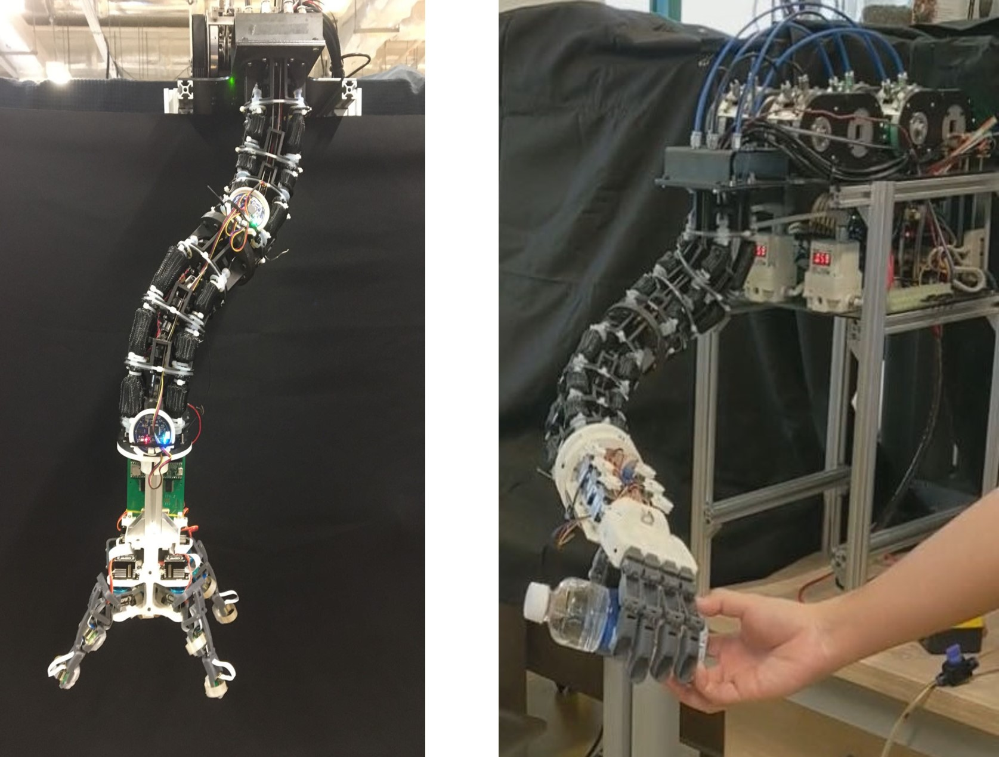

Soft/continuum robots are inspired by the biological elephant’s trunks or snakes. Unlike conventional rigid robots, soft/continuum robots have inherent compliance, a lightweight nature, and theoretically in-finite degrees of freedom (DoFs), enabling them with the capability to adapt to unstructured environments. Based on these inherent strengths, continuum robots stand as a promising avenue for safe physical human-robot interaction (pHRI). In particular, soft/continuum robots have been widely applied in the medical field, such as minimally invasive surgery. However, with the continuous growth of human needs, continuum robots are no longer limited to the field of minimally invasive medical treatment but also show great potential in the service field, such as the daily object grasping, assistance in activities of daily living, physical human interaction, and upper limb support exoskeleton.

## Publication
1. E. Harsono, J. Yang, S. Bhattacharya, and H. Yu, “Design and analysis of a novel hybrid-driven continuum robot with variable stiffness,” in Mechanism and Machine Theory, vol. 177: 105067, 2022, doi: 10.1016/j.mechmachtheory.

