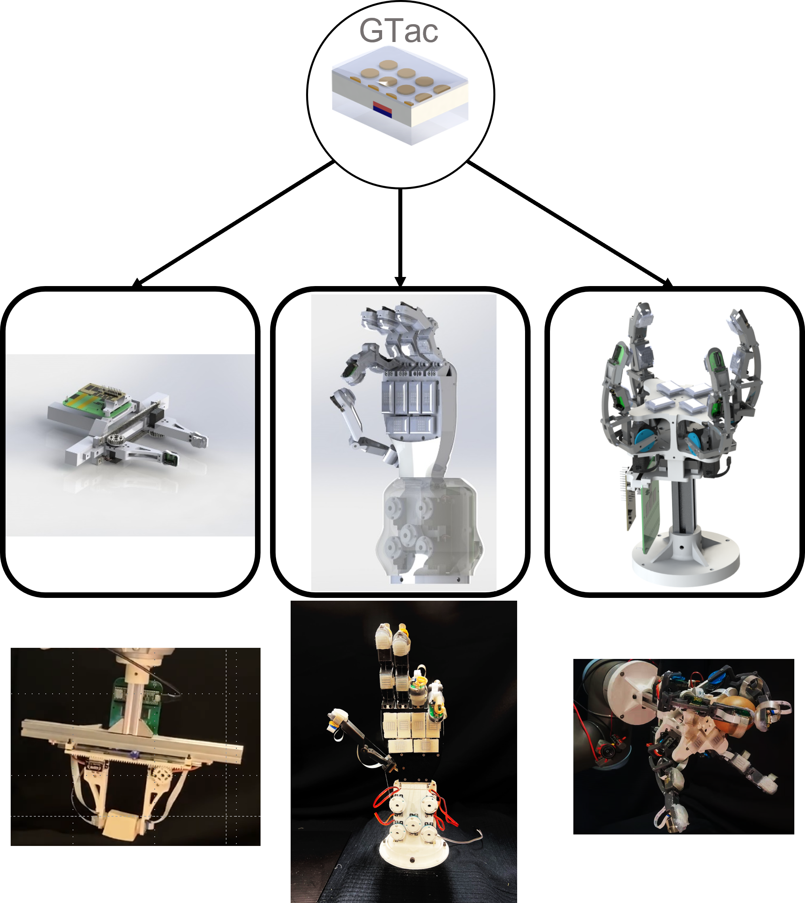

The tactile sensing capabilities of human hands play a crucial role in performing daily activities. By perceiving both normal and shear forces through mechanoreceptors integrated into the fingers and palm, humans are able to effectively grasp objects and perform smooth handovers. To address this need, a proposal has been put forth for the development of a biomimetic tactile sensor that closely mimics the tactile sensing capabilities of human hands. This sensor incorporates a skin-like heterogeneity, enabling it to perceive both normal and shear contact forces simultaneously. By integrating these sensors into a robotic hand, the resulting system can effectively grasp delicate objects and accurately identify their ECSs using human-like patterning and learning models. This capability empowers robots to undertake challenging tasks, such as object handovers, with precision and dexterity. The insightful design of this biomimetic tactile sensor introduces heterogeneous force sensing, presenting the immense potential for supporting robots in their pursuit of acquiring and replicating human skills. 



## Publications
1. Z. Lu, X. Gao and H. Yu, "GTac: A Biomimetic Tactile Sensor With Skin-Like Heterogeneous Force Feedback for Robots," in IEEE Sensors Journal, vol. 22, no. 14, pp. 14491-14500, 15 July15, 2022, doi: 10.1109/JSEN.2022.3181128.
2. Z. Lu, H. Guo, W. Zhang and H. Yu, "GTac-Gripper: A Reconfigurable Under-Actuated Four-Fingered Robotic Gripper With Tactile Sensing," in IEEE Robotics and Automation Letters, vol. 7, no. 3, pp. 7232-7239, July 2022, doi: 10.1109/LRA.2022.3181370.

